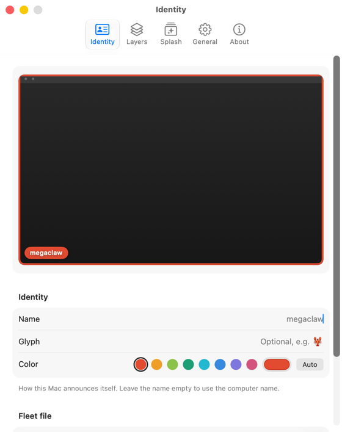

# Nameplate

**Brand every machine in your fleet — macOS, Windows, and Linux — so you always know which one you just remoted into.**

If you drive a herd of Macs over [Jump Desktop](https://jumpdesktop.com/), Screen Sharing, or any other remote desktop, the screens all look the same. Nameplate gives each Mac an unmistakable identity — like an aircraft livery — rendered as click-through overlays that float above everything:

- **Frame** — a colored border around every display, with rounded corners that follow the screen's curve. Always visible, costs zero pixels of workspace, survives fullscreen apps.
- **Name tag** — a small pill with the Mac's name (and an optional emoji glyph) pinned to a corner.
- **Watermark** — a big translucent name across the screen, readable from across the room.
- **Connect splash** — the Mac's name flashes center-screen when a remote session likely just started, then fades out.
- **Menu bar plate** — a colored mini-nameplate (plus the name) in the menu bar. Its menu doubles as a glanceable dashboard: uptime, IP address (click to copy), CPU load, RAM, and free disk, plus layer toggles.
- **Attention alerts** — a bundled CLI lets agents and scripts summon a topmost message card with pulsating screen borders when they need the human (e.g. right before a 1Password auth prompt).

Your wallpaper stays untouched — everything is a transparent overlay, so you can keep any background you like.

Each Mac gets a stable default color derived from its hostname, so even an unconfigured fleet is instantly tellable-apart.

<p align="center"></p>

## Install

**macOS** — download the [DMG](https://github.com/steipete/Nameplate/releases/latest/download/Nameplate.dmg) (drag to install), or:

```sh
brew install --cask steipete/tap/nameplate
```

**Windows** — grab [Nameplate-Windows-x64.zip](https://github.com/steipete/Nameplate/releases/latest/download/Nameplate-Windows-x64.zip) (or `arm64`) from the latest release: a single self-contained `nameplate.exe` (tray app + CLI in one binary). Source lives in [`windows/`](windows/).

**Linux** — grab [Nameplate-Linux-x86_64.tar.gz](https://github.com/steipete/Nameplate/releases/latest/download/Nameplate-Linux-x86_64.tar.gz) (or `arm64`) from the latest release; requires `libgtk-4`, built for X11 fleets (xrdp/VNC), Wayland best-effort. Source lives in [`linux/`](linux/).

All three share the same fleet file, the same hostname-derived default colors, and the same `nameplate attention` / `nameplate splash` CLI.

Or build the Mac app from source (requires Xcode 26 / Swift 6.2+):

```sh
git clone https://github.com/steipete/Nameplate.git
cd Nameplate
./Scripts/package_app.sh release
open Nameplate.app
```

`package_app.sh` signs with a Developer ID identity; pass your own via `APP_IDENTITY="Developer ID Application: You (TEAMID)"`, or use ad-hoc signing for a quick local build: `APP_IDENTITY="-" ./Scripts/package_app.sh release`.

## Configure

Click the nameplate in the menu bar → **Settings…** (opens automatically on first launch):

- **Identity** — name, color (8 presets or custom), optional glyph. Empty name = computer name.
- **Layers** — frame thickness/opacity and per-corner rounding (macOS defaults to rounded bottom corners; Windows and Linux default to square corners), tag corner and optional IP/uptime/macOS/location info lines, watermark corner/opacity.
- **Splash** — duration and triggers (display wake, screen unlock, display reconfiguration).
- **General** — start at login, menu bar appearance, and decoration visibility: **Always** or **Only when viewed remotely** — frame, tag, watermark, and splash appear only on virtual displays (Jump Desktop and similar identify themselves by display name/vendor) or while a Screen Sharing/VNC connection is established. Attention alerts always show, so agents can still reach you when you're sitting at the Mac.

### Fleet file

Manage the whole fleet from one dotfile. Nameplate reads `~/.config/nameplate/fleet.json`, keyed by short hostname:

```json
{
  "megaclaw": { "name": "MEGACLAW", "color": "#1D9E75", "glyph": "🦞", "location": "Phoenix" },
  "clawmac":  { "name": "clawmac",  "color": "#E24B30", "glyph": "🔥", "location": "Atlanta (MacStadium)" },
  "studio-1": { "color": "#7F77DD" }
}
```

All fields are optional; anything missing falls back to local settings. `location` (when set) shows in the status menu and connect splash. Sync the file via your dotfiles and every Mac picks up its own entry. Changes are applied live.

### CLI

The app bundle ships a CLI at `Nameplate.app/Contents/Helpers/nameplate` (symlink it onto your PATH):

```sh
ln -s /Applications/Nameplate.app/Contents/Helpers/nameplate ~/bin/nameplate

nameplate attention "Need 1Password approval for release verification — no secret read." \
  --title "Codex → 1Password" --wait --timeout 300
nameplate splash      # replay the identity splash
nameplate settings    # open settings
nameplate dismiss     # clear any active attention alert
```

`attention` shows a topmost card (click to dismiss) plus pulsating borders on every display — built for AI agents that need a human at the keyboard, with the *reason* right in the alert. The card stays until clicked; pass `--duration <seconds>` to auto-dismiss instead. With `--wait`, the CLI blocks for up to 600 seconds by default (override with `--timeout <seconds>`) and exits `0` when clicked, `3` when app-driven dismissal clears it, or `4` when the wait times out or the request expires before presentation. Concurrent alerts queue in order. `nameplate dismiss` clears active and queued alerts without quitting Nameplate. It launches the app if needed. An agent skill ships in [skills/nameplate-attention](skills/nameplate-attention/SKILL.md) — copy it into your agent's skills directory.

### Scripting without the CLI

Darwin notifications work from anywhere, including SSH sessions, with no app activation:

```sh
notifyutil -p com.steipete.nameplate.splash
notifyutil -p com.steipete.nameplate.settings
```

The `nameplate://splash` and `nameplate://settings` URLs are registered as well, but URL delivery to menu-bar-only apps is unreliable on current macOS betas — the Darwin notifications are the dependable path.

### Updates

Release builds update via [Sparkle](https://sparkle-project.org) (feed: `appcast.xml` on `main`). Dev and Homebrew builds keep Sparkle disabled.

## Why the splash triggers are heuristics

macOS has no public "a remote session just connected" event. Nameplate reacts to the events that accompany a connect in practice: displays waking, the session unlocking, and display reconfiguration (on headless Macs, the remote-desktop host plugging in its virtual display fires this). Each trigger can be toggled individually.

## Development

```sh
swift build          # needs full Xcode (SwiftUI macros), not just CommandLineTools
swift test
./Scripts/package_app.sh          # debug .app bundle
```

## License

MIT — see [LICENSE](LICENSE). © 2026 Peter Steinberger.
