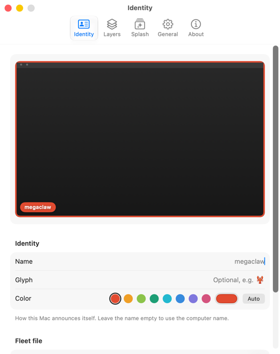

# Nameplate 🪪 — Know which machine you’re driving

[](https://github.com/steipete/Nameplate/actions/workflows/ci.yml)
[](https://github.com/steipete/Nameplate/releases/latest)
[](#install)
[](LICENSE)
[](https://github.com/steipete/homebrew-tap)

Nameplate gives each machine in a remote-desktop fleet a stable visual identity. It renders click-through frames, name tags, watermarks, and connect splashes on macOS, Windows, and Linux without changing the wallpaper.

<p align="center"></p>

Each unconfigured machine gets a color derived from its hostname. Open the [interactive tour](https://nameplate.sh) to try the layers and settings in a browser.

## Install

| Platform | Smallest install |
| --- | --- |
| macOS 15+ (Apple silicon) | `brew install --cask steipete/tap/nameplate` |
| Linux (x86_64 or arm64) | `brew install steipete/tap/nameplate` |
| Windows (x64 or arm64) | Download the matching ZIP from the [latest release](https://github.com/steipete/Nameplate/releases/latest) |

On macOS, the [DMG](https://github.com/steipete/Nameplate/releases/latest/download/Nameplate.dmg) is available as a direct install. Linux release tarballs require the system GTK4 and X11 runtime libraries; see the [Linux guide](linux/README.md). The Windows archive contains one self-contained tray app and CLI; see the [Windows guide](windows/README.md).

## Quick start

After the macOS Homebrew install:

```sh
open -a Nameplate
nameplate splash
```

Settings opens on the first launch. Choose a name, color, optional glyph, and the layers to show; `nameplate splash` then replays the identity card. Windows and Linux expose the same splash command through their installed executable.

## What appears on screen

| Layer | Behavior |
| --- | --- |
| Frame | Outlines every display and remains visible above full-screen apps. |
| Name tag | Pins the machine name and optional glyph to a chosen corner. |
| Watermark | Shows a large translucent identity label. |
| Connect splash | Traces the display perimeter and presents the identity after connection-related events. |
| Attention alert | Lets a script display a topmost message card with pulsing borders. |

The macOS menu bar plate also shows uptime, IP address (click to copy), CPU load, memory, and free disk space. Decorations can remain visible or appear only on virtual displays and during detected remote-viewing sessions.

## Fleet identity

Nameplate reads `~/.config/nameplate/fleet.json`, keyed by lowercase short hostname. The shared fields work on all three platforms:

```json
{
  "megaclaw": { "name": "MEGACLAW", "color": "#1D9E75", "glyph": "🦞" },
  "clawmac": { "name": "clawmac", "color": "#E24B30", "glyph": "🔥" },
  "studio-1": { "color": "#7F77DD" }
}
```

All fields are optional, and edits apply live. macOS also accepts `location`; platform-specific settings and precedence are documented in [Configuration](docs/configuration.md).

## CLI and automation

The installed executable handles both the app and its commands:

```sh
nameplate attention "Need approval before release" --title "Agent needs attention"
nameplate splash
```

`attention` and `splash` work on all three platforms. macOS also provides blocking acknowledgements, settings and dismissal commands, Darwin notifications, URL actions, and an [agent skill](skills/nameplate-attention/SKILL.md). See the [CLI reference](docs/cli.md) for syntax and platform differences.

## Connection behavior

Windows receives remote-connect and session-unlock events directly. Linux uses logind unlock events and targets X11 fleets; Wayland support requires a compositor with the layer-shell protocol and is best-effort.

macOS has no public remote-session connection event. Nameplate instead reacts to display wake, screen unlock, and display reconfiguration, which are the events remote-desktop hosts produce in practice. Each trigger can be disabled in Settings.

## Development

The macOS app requires Xcode 26 with Swift 6.2 or newer. From the repository root:

```sh
swift build
swift test
APP_IDENTITY="-" ./Scripts/package_app.sh debug
```

`package_app.sh` defaults to the maintainer's Developer ID. Set `APP_IDENTITY="Developer ID Application: You (TEAMID)"` to use your own identity, or keep `APP_IDENTITY="-"` for an ad-hoc local build.

Windows requires the .NET 8 SDK; Linux requires Rust 1.92 plus GTK4 and X11 development libraries. Their build commands live in the [Windows](windows/README.md) and [Linux](linux/README.md) guides.

## License

MIT — see [LICENSE](LICENSE). © 2026 Peter Steinberger.
